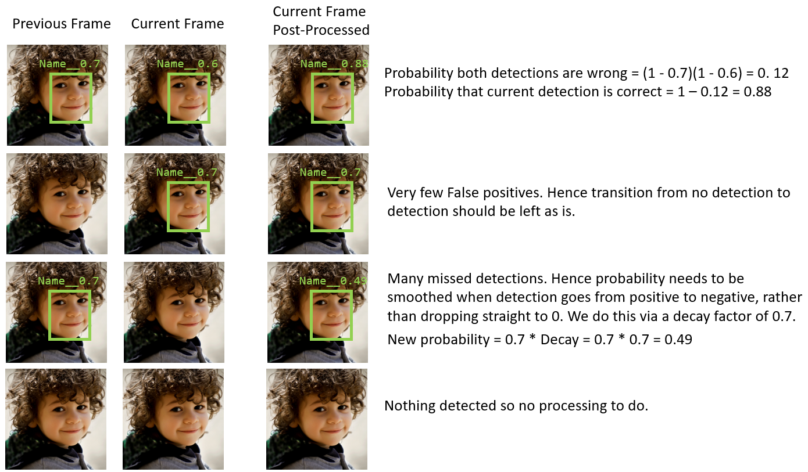

# Face-Reidentification
Face Reidentification using Facenet + Temporal consistency between frames in video

Modified code from:

https://github.com/timesler/facenet-pytorch

Additional code was added to improve accuracy on video inputs, using the fact that the bounding boxes between consecutive frames should be similar.

The temporal consistency(TC) post-processing follows the logic below:



To run the code:

```
python infer.py
```

You can view the difference with and without the temporal consistency by commenting out ```line 187``` in ```infer.py```:

```
new_state.combine_state(cur_state)
```

The video files ```out3.avi``` (With TC) and ```out4.avi``` (Without TC) also show this difference.

## Camera / Video File Input
To run code with webcam, set the ```webcam``` variable to ```True``` in ```line 43``` of ```infer.py```.
```
webcam = True
```

To run code with a video file, set the ```webcam``` variable to ```False``` in ```line 43``` of ```infer.py``` and set the filenames for ```input_filename``` and ```output_filename```.
```
webcam = False
skip = False
input_filename = 'test_vid2.mp4'
output_filename = 'out3.avi'
```

The ```skip``` variable is to skip frames for faster inference.


